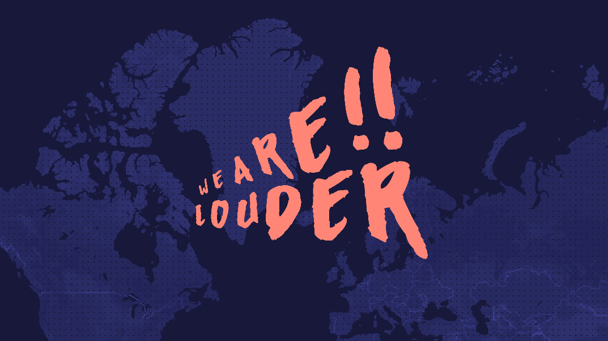
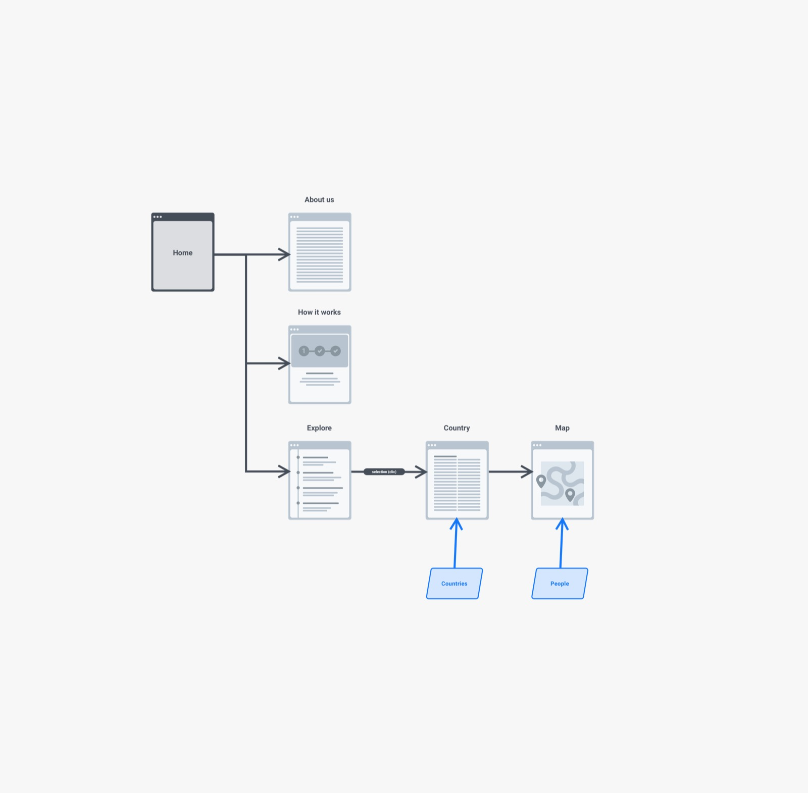
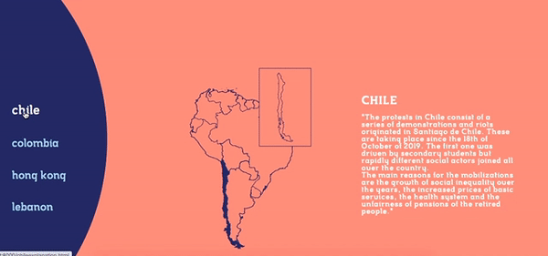
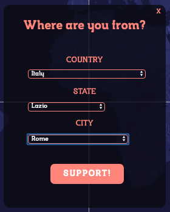
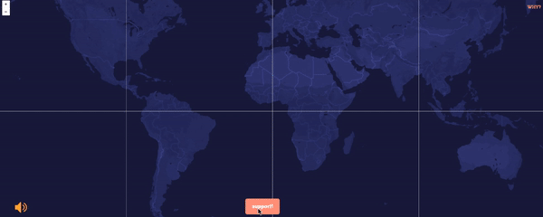
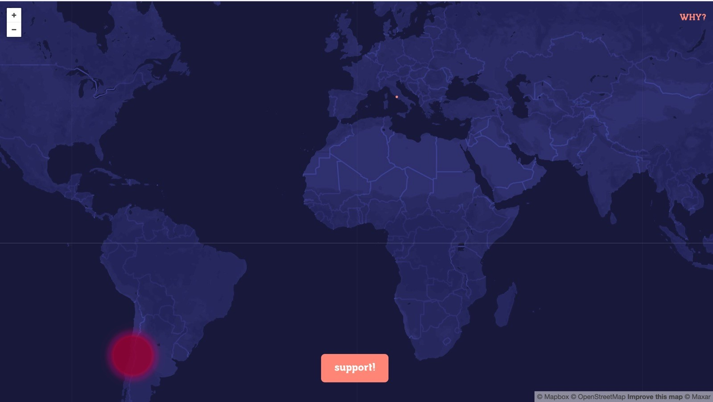

# WE ARE LOUDER

<br>

## Our team

“We are louder” was created by Giorgio Ventura, Michele Sasso, Maria del Pilar Suarez Anzorena and María Paula Vargas. It is a collaborative platform whose concept and usage is based on the partecipation of several people around the world, in order to create a unique experience.


## About us

We developed “we are louder” as a form of a symbolic activism to close the gap between people who wants to be part of a cause but for some reason he/she can’t be there, but also, to get moved by being part of what people are able to achieve together. “We are louder” is not meant to replace a protest, even though is inspired by it, it’s a pacific symbolic form of giving people a voice to be part of something bigger than themselves.


## Project idea

In the past few months, we’ve seen people protesting around the world. People have built big manifestations that has inspired many to shout out loud and express what has been difficult to say by other means. More than a legal right, protesting is a need, a collective one. Most of them are triggered by a general feeling of discontent, usually that has been accumulated by years of bearing injustices, either by governments, companies, or generally by people in charge of major decisions. A protest is a massive call out, inspiring collective movements that aims one special request… they just want to be heard, they want people to understand what they want to say.
 
Protest has many forms, many symbols and many ways that people use in the attempt of cause a certain disruption in order to boost desired and needed changes on society. However, people find many obstacles when being active on protests, especially when they can’t physically be present, because they’re abroad, studying, working or simply because they needed to get away from their home. Sometimes also because protests, even though they meant to be peaceful, it turns into violence, finding several confrontations with the public force that even more than injuries and considerable public damages, it ends up gradually losing participants along the way.
 
Our website won’t ever replace a protest, but it’s a symbolic activism that keep the fire of it alive. It is a form of protest that close the distance between those who want to be there but for any circumstances they can’t. It’s a way to be present and being part of something bigger than themselves.

## Inspiration

One of our main sources of inspiration, has been the “cacerolazo”, an spanish word that comes from “cacerola” that in english means pot. The cacerolazo consist in a group of people that gather together in order to make noise by hitting pots and pans and other kitchen utensils in order to call for attention. Here, the sound of pots turns out to be more than a noise, but a powerful symbol that allows many people, regardless of the age, their occupation, and encourage them to be part of the movement in a safe and pacific way. 

[Colombia: cacerolazos contra Iván Duque inundan la noche en Bogotá](https://www.youtube.com/watch?v=2k4obVDMTBY)

## Context of use

The platform is meant to be used mainly from personale computers, in order to have the best experience possible. It is to be used everytime there's an important manifestation that can involve people abroad or have international implications.


## Web architecture 

<br>


## Libraries and methods


- **p5.js**: a library used to create graphic and interactive experiences, based on the principles of Processing. <br>

- **p5.dom.js**: a core library that is part of the p5.js distribution.<br>
- **p5.min.js**: the minified version of p5. It is compressed for faster page loading.<br>
- **p5.sound.min.js**: a core library that is part of the p5.js distribution.<br>
- **p5.geolocalization.js**: a community library of p5.js created by Ben Moren. It provides techniques for acquiring, watching, calculating and geofencing user locations.<br>
- **p5.tiledmap.js**: it provides drawing and helper functions to include maps in sketches.<br>

- **mapbox.com**: a location data platform for mobile and web applications. <br>
- **Nodes.js**: an open-source, cross-platform, JavaScript runtime environment that executes JavaScript code outside of a browser.<br>


## Usage

<br>


## Map technology

### Form Creation

<br>

The form is created inside a differend div element that is over the map and made invisible. It is activated by pushing the "support" button on the map, that activates the javascript function: 
```javascript
<div id="textsupport" style="display:block; margin-right: 1%;">
      <button type="button" class = "button"> support! </button>
    </div>

  <div id="form" style="display:none;">
      <h1 id="x" style="display:none; margin-right: 1%;"> X </h1>
      <h2>Where are you from?</h2>
      <h3>COUNTRY</h3>
      <h3>STATE</h3>
      <h3>CITY</h3>
      <button id="submit" class="thabutton">SUPPORT!</button>
    </div>

<script>
var supportButton = document.getElementById('textsupport');
var backButton = document.getElementById('x');
var submitButton = document.getElementById('submit');

function DisplayBlock () {
  if (form.style.display = 'none') {
    form.style.display = 'block';
    supportButton.style.display = 'none';
    x.style.display = 'block';
  }
}

function DisplayNone () {
  if (form.style.display = 'block') {
    form.style.display = 'none';
    supportButton.style.display = 'block';
    backButton.style.display = 'none';
  }
}

supportButton.addEventListener('click', DisplayBlock);
backButton.addEventListener('click', DisplayNone);
submitButton.addEventListener('click', DisplayNone);
</script>
```

The form is created using three `.json` files containing all the countries, states and major cities in the world, so people can indicate where are they from, or the biggest city available, without using the actual geolocalization, in order to maintain the privacy and anonimity of the user. 
Throught the use of several `for(){}` cicles we are able to fullfill the various dropdown menu untill we get to the choice of the city, that will be the one we'll get the coordinates from, to draw, then, the point on the map.

```javascript
var dropdown1;
var dropdown2;
var dropdown3;
var canvas;
var data;
var nations;
var states;
var cities;


function preload() {
  nations = loadJSON("countries.json");
  states = loadJSON("states.json");
  cities = loadJSON("cities.json");
  coordinates = loadJSON("coordinates.json");
}

function setup() {
  canvas = createCanvas(windowWidth, windowHeight);
  canvas.parent("#tela");

  geomap = mappa.tileMap(options);
  geomap.overlay(canvas);

  dropdown1 = createSelect();
  dropdown1.parent('#form');
  dropdown1.position(60, 160);
  dropdown2 = createSelect();
  dropdown2.parent('#form');
  dropdown2.position(60, 240);
  dropdown3 = createSelect();
  dropdown3.parent('#form');
  dropdown3.position(60, 320);
  for (var i = 0; i < nations.countries.length; i++) {
    allthecountrynames.push(nations.countries[i].name);
  }
  for (var i = 0; i < allthecountrynames.length; i++) {
    dropdown1.option(allthecountrynames[i]);
  }
  dropdown1.changed(fillDrop2);
}

function fillDrop2() {
  // azzero le options del drop
  dropdown2.id("options2");
  document.getElementById("options2").innerHTML =
    null;
  // se il terzo drop ha delle options le cancello
  dropdown3.id("options3");
  if (dropdown3.option.length > 0) {
    document.getElementById("options3").innerHTML =
      null;
  }

  var sceltacountry1 = dropdown1.value();
  var idScelta1 = readId(sceltacountry1)

  // Riempiamo statesnames
  for (var i = 0; i < states.states.length; i++) {
    if (states.states[i].country_id == idScelta1) {
      statesnames.push(states.states[i].name);
    }
  }

  // Riempiamo dropdown2 con l'array statesnames
  for (var i = 0; i < statesnames.length; i++) {
    dropdown2.option(statesnames[i]);
  }

  statesnames = [];

  dropdown2.changed(fillDrop3);
}

function fillDrop3() {
  // azzero le options del drop
  dropdown3.id("options3");
  document.getElementById("options3").innerHTML =
    null;

  var sceltacountry2 = dropdown2.value();
  var idScelta2 = readstatesId(sceltacountry2)

  // Riempiamo citiesnames
  for (var i = 0; i < cities.cities.length; i++) {
    if (cities.cities[i].state_id == idScelta2) {
      citiesnames.push(cities.cities[i].name);
    }
  }

  // Riempiamo dropdown3 con l'array citiesnames
  for (var i = 0; i < citiesnames.length; i++) {
    dropdown3.option(citiesnames[i]);
  }

  citiesnames = [];
  dropdown3.changed(getCoo);
}

  for (let i = 0; i < supporters.length; i++) {
    fill('#ff8676');
    ellipse(point.x, point.y, 4);
  }

  console.log(point.x);
  console.log(point.y);
  // console.log(supporters.length);
  // console.log(supporters);
```

<br>

### Creating the point

For a long time it has been difficult to create dots anchored to the map. The main problem was that it coordinates got from the form were converted in pixels that defined one and one only point on the screen and not on the map, since these pixels didn't update according to the moving of the map.

The form is finished with a support button, that pushes the `support()` function, whos aim is to use the information to light up a city. The coordinates got from the third dropdown menu, stored in the `cities.json` file, are compared to the information stored inside the `coordinates.json` file, and if the information line up, the coordinates are turned into pixels throught the `.latLngToPixel()` function. Then, the point is pushed into and array that will store the item and make it available for the `draw()` function.

```javascript
function getCoo() {
  var sceltaCity = dropdown3.value();
  latCity = readLat(sceltaCity);
  lngCity = readLng(sceltaCity);
}

function readLat(_cooLat) {
  for (var i = 0; i < coordinates.coordinates.length; i++) {
    if (coordinates.coordinates[i].name == _cooLat) {
      return (coordinates.coordinates[i].lat);
    }
  }
}

function readLng(_cooLng) {
  for (var i = 0; i < coordinates.coordinates.length; i++) {
    if (coordinates.coordinates[i].name == _cooLng) {
      return (coordinates.coordinates[i].lng);
    }
  }
}

// legge l'id del country selezionato
function readId(_countryName) {

  for (var i = 0; i < nations.countries.length; i++) {
    if (nations.countries[i].name == _countryName) {
      return (nations.countries[i].id);
    }
  }
}

// legge l'id del state selezionato
function readstatesId(_statesName) {

  for (var i = 0; i < states.states.length; i++) {
    if (states.states[i].name == _statesName) {
      return (states.states[i].id);
    }
  }
}

function draw() {
  clear();
  var submit = select('#submit');
  submit.mousePressed(support);
  point = geomap.latLngToPixel(latCity, lngCity);
  for (let i = 0; i < supporters.length; i++) {
    fill('#ff8676');
    ellipse(point.x, point.y, 4);
  }

function support() {
  for (var i = 0; i < 1; i++) {
    supporters.push("a_supporter");
  }
}
```

## Sound

<br>

At the moment the submit button is pushed and the location is added, here it is a "surprise": A new draw is made and the sound is played, starting to make the noise of the protest as it is there on the place, where your support is needed.

```javascript
function draw() {
  clear();
  push();
  var submit = select('#submit');
  submit.mousePressed(support);
  point = geomap.latLngToPixel(latCity, lngCity);
  for (let i = 0; i < supporters.length; i++) {
    fill('#ff8676');
    ellipse(point.x, point.y, 4);
    if (pot.isPlaying() == false) {
      pot.play();
    } else {
      pot.pause();
    }
  }
  pop();

  let spectrum = fft.analyze();
  push();
  if(pot.isPlaying() == true ){
  bogota = geomap.latLngToPixel(4.6482837,-74.2478934);
  noStroke();
  fill(201, 27, 43, 3);
  for (var i = 0; i < spectrum.length; i++) {
    let d = map(spectrum[i], 0, 0.3, 0.3, 0);
    ellipse(bogota.x, bogota.y, d);
    }
  }
  pop();
}
```
